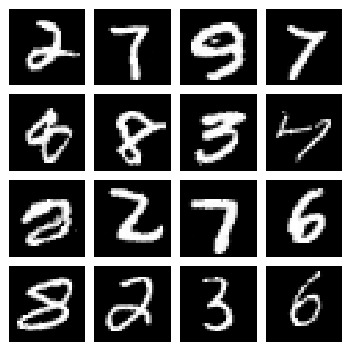
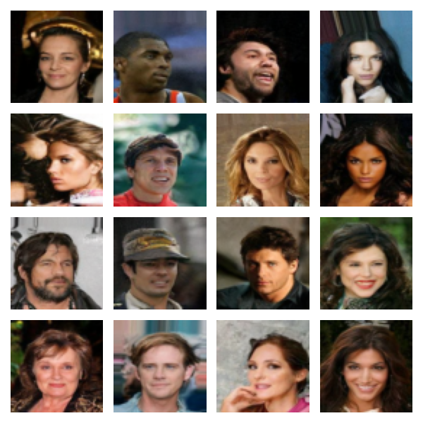

# Diffusion Models from Scratch — DDPM → DiT → Rectified Flow

A from-scratch (no `diffusers`) diffusion implementation: a **controlled study** of three
backbones / training objectives — UNet + DDPM, DiT, and Rectified Flow — with FID,
NFE-efficiency curves, and modern ML-systems analysis.

Status: the 2×2 controlled study (UNet/DiT × DDPM/rectified flow) has its code and protocol
frozen and is training on a 5-GPU server; the DDPM baseline is complete on MNIST 28×28
and CelebA 64×64.

| MNIST 28×28 (UNet 12M, 170 epochs) | CelebA 64×64 (UNet 174M, 300 epochs) |
|---|---|
|  |  |

## Highlights

- **Core algorithms from scratch**: DDPM forward/reverse processes, UNet (sinusoidal time
  embedding / residual blocks / mid-block attention), DiT (adaLN-Zero, unconditional), and
  Rectified Flow (linear-interpolation path + Euler ODE sampling)
- **Training systems**: torchrun DDP (up to 5 GPUs), YAML configs, checkpoint resume, EMA,
  per-epoch snapshots, cost accounting
- **Evaluation**: FID (reference stats consistent with the training preprocessing),
  FID-vs-NFE curves (planned)
- **ML systems**: params / FLOPs / step time / throughput / MFU, torch.compile,
  Triton fused AdaLN, CUDA-Graph sampling (planned)

## Setup

Python 3.10+; dependencies are managed with [uv](https://docs.astral.sh/uv/):

```bash
uv sync              # torch / numpy / matplotlib / pillow / tqdm / pyyaml
uv sync --extra log  # extra: wandb (training logs)
```

## Quick Start

```bash
# MNIST smoke run (single GPU)
uv run python main.py train --config configs/mnist.yml

# The four cells of the CelebA 2x2 study
uv run python main.py train --config configs/celeba_unet_eps.yml   # A: UNet + DDPM
uv run python main.py train --config configs/celeba_dit_eps.yml    # B: DiT  + DDPM
uv run python main.py train --config configs/celeba_unet_rf.yml    # C: UNet + rectified flow
uv run python main.py train --config configs/celeba_dit_rf.yml     # D: DiT  + rectified flow

# 5-GPU DDP
CUDA_VISIBLE_DEVICES=0,1,2,3,4 \
  torchrun --standalone --nproc_per_node=5 main.py train --config configs/celeba_dit_rf.yml

# Sampling (EMA weights by default) / denoising animation
uv run python main.py sample --run-name celeba_dit_rf --n 64
uv run python demo.py --dataset celeba
```

> On multi-GPU servers, set `NCCL_P2P_DISABLE=1` if training hangs on communication.
> Smoke test: `uv run python tests/test_sanity.py` (13 CPU-only invariant checks);
> add `--max-steps 50` for a quick pre-flight check before a full server run.

## Project Structure

```
├── models/             # Backbones
│   ├── unet.py         # UNet (DDPM baseline)
│   └── dit.py          # DiT: patchify + adaLN-Zero + SDPA
├── diffusion/          # Diffusion processes
│   ├── ddpm.py         # DDPM: forward noising / eps loss / ancestral sampling
│   └── flow.py         # Rectified flow: linear path / v loss / Euler sampling
├── configs/            # YAML configs for the four cells + MNIST
├── tests/              # Invariant and shape tests
├── reports/            # Experiment protocol and technical report (results pending)
├── figures/            # Result figures
├── train.py            # Training loop, data pipeline, EMA, checkpoints, cost accounting
├── main.py             # CLI entry point (train / sample)
├── demo.py             # Denoising visualization
├── pyproject.toml      # uv dependency definition
└── uv.lock
```

## Implementation Notes

- `diffusion/ddpm.py`: `forward_diffusion` follows `x_t = √ᾱ_t·x₀ + √(1-ᾱ_t)·ε`;
  `training_loss` is the MSE between predicted and true noise; `sample` runs ancestral
  sampling (optionally returning the full trajectory).
- `diffusion/flow.py`: convention is `t=0 → data`, `t=1 → noise`, `x_t = (1-t)·x₀ + t·ε`,
  regressing `v = ε - x₀`; sampling integrates the ODE from `t=1` back to `t=0`. The model
  sees `t × 1000` because the sinusoidal embedding is calibrated for [0, 1000] (as in DDPM).
- `models/unet.py`: sinusoidal time embeddings are injected into every residual block via an
  MLP; SDPA self-attention sits at the bottleneck; skip connections preserve multi-scale
  information across down/up stages.
- `models/dit.py`: patch 4 → 256 tokens, fixed 2D sincos positional embedding, adaLN-Zero in
  every block (modulation MLP zero-initialized, so the network starts as the identity —
  verified to output exactly 0 at init).
- `train.py`: data pipeline (MNIST pkl / CelebA zip → preprocessing cache), `--backbone` /
  `--objective` switches, LR warmup + cosine decay, gradient clipping, EMA (raw and EMA
  weights are stored separately), per-epoch snapshots, per-epoch loss / grad-norm /
  throughput logging, and a `results/{run_name}.json` archive (config, seed, git commit,
  peak memory).
