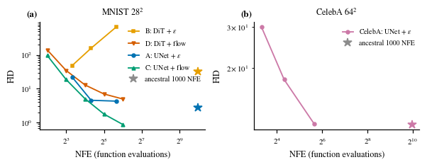
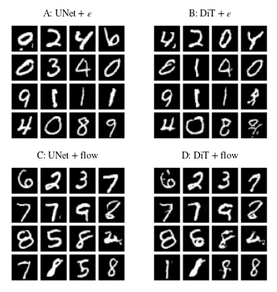
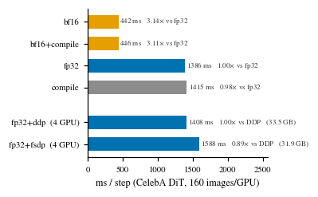

# Diffusion Models from Scratch — DDPM → DiT → Rectified Flow

*[English](README.md)*

从零实现扩散模型，不使用 `diffusers`：UNet 与 DiT 两种骨干、ε-prediction 与 rectified flow
两种训练目标、DDPM/DDIM/Euler 三种采样器，以及训练与评估的完整管线。在 MNIST 上用 2×2
受控设计对比两个骨干与两个目标，并用一个已训好的 CelebA UNet 测量采样器选择带来多少开销、
换回多少质量。完整协议与负结果见 `reports/` 下的技术报告。



## 结果

### MNIST 2×2

四个模型各训 200 epochs，同一套协议（同优化器、调度、batch、随机种子）。

| 单元 | 骨干 + 目标 | 参数 | GFLOPs/样本 | 最佳 FID | NFE |
|---|---|---|---|---|---|
| A | UNet + ε | 11.7M | 2.43 | 2.79 | 1000 祖先采样 |
| B | DiT + ε | 16.5M | 1.08 | 33.18 | 1000 祖先采样 |
| C | UNet + flow | 11.7M | 2.43 | **0.88** | 64 Euler |
| D | DiT + flow | 16.5M | 1.08 | 4.99 | 64 Euler |

DiT 参数更多，但 FLOPs 只有 UNet 的 44%，所以这不是等算力对比；表里列出 FLOPs 就是让这一点
可见。rectified flow 在每个预算下都优于 ε-prediction，交叉点约在 NFE 16。



### CelebA 采样器

一个已训好的模型（UNet，174M 参数，300 epochs），四种采样预算。没有任何重训。

| 采样器 | NFE | n | FID | 吞吐 | 5×10k 子集波动 |
|---|---|---|---|---|---|
| DDIM | 10 | 50k | 30.03 | 194 /s | 30.90 ± 0.15 |
| DDIM | 20 | 50k | 17.79 | 97 /s | 18.72 ± 0.09 |
| DDIM | 50 | 50k | **11.45** | 39 /s | 12.41 ± 0.08 |
| 祖先采样 | 1000 | 10k | 11.37 | 1.9 /s | — |

DDIM 用 50 步就能追到 1000 步祖先采样的 0.8% 以内，快 20 倍。波动列还说明一件事：同一个采样器
用 10k 子集评估，FID 会比 50k 全量高约 1，这正是协议要求报告子集波动的原因。

### 系统测量

CelebA 的 DiT，每卡 batch 160，预热后测 30 步。



| 设置 | s/step | 峰值显存 | MFU | 相对 |
|---|---|---|---|---|
| fp32 | 1.386 | 32.9 GB | 10.4% | 1.00× |
| bf16 | 0.442 | 21.1 GB | 32.7% | 3.15× |
| `torch.compile` | 1.415 | 32.9 GB | 10.4% | 1.00× |
| fp32 + DDP，4 卡 | 1.408 | 33.5 GB | 10.1% | — |
| fp32 + FSDP，4 卡 | 1.588 | 31.9 GB | 9.0% | 0.89×（对 DDP） |

fp32 一步的 kernel 时间占比：matmul 67.6%、elementwise 15.3%、attention 11.1%、norm 2.3%。

只有 bf16 改变了步时；`torch.compile` 的结果与基线三位数字都相同。FSDP 用每步多 12.8% 的时间
换来 4.8% 的显存下降，因为峰值由激活值决定：参数、梯度与 Adam 状态加起来只占 33.5 GB 里的
约 2 GB。这次测量的价值在判断标准而不在结论：当状态而非激活值决定显存上限时，分片才划算。

## 一个会反转的采样器

预算增加时，DDIM 让 UNet 变好（FID 从 10 步的 22.06 到 50 步的 4.32），却让 DiT 变差
（49.14 到 672.39）；同样权重的祖先采样是 33.18。四项对照排除了 EMA 权重（raw 权重同样失败）、
模型本身（祖先采样正常）与采样器实现（它在 UNet 上有效）。在固定 50 步下把 DDIM 的 η 从 0 提到
1，饱和像素比例从 0.48 升到 0.79，样本从斑块恢复成数字。确定性更新会把模型的 score 误差同向
累积，而祖先采样每步注入的噪声把漂移压住。

bf16 训练有同样的签名：单格重训的训练 loss 与 fp32 三位数字一致（0.0194 对 0.0193），但 1000 步
FID 翻倍（5.56 对 2.79），50 步 FID 不变。

## 目录结构

```
├── models/             # unet.py、dit.py（adaLN-Zero）
├── diffusion/          # ddpm.py（ε，祖先采样 + DDIM）、flow.py（rectified flow、Euler）
├── eval/               # fid.py、cost.py、systems.py、eta_sweep.py、eps_error_by_t.py、
│                       # make_table.py
├── configs/            # 四个 MNIST 单元、四个 CelebA 单元
├── scripts/            # cheap_package.sh（五阶段）、tier2.sh、status.sh
├── tests/              # 14 项 CPU 不变量测试
├── reports/            # 技术报告、运行手册、图表脚本
├── results/            # 原始数据，每个 run 一个 JSON
└── figures/
```

## 复现

```bash
uv sync && uv run python tests/test_sanity.py     # 14 项 CPU 测试，约 1 分钟

# MNIST 2x2 → 两套 FID 扫描 → 系统测量 → 出图
GPUS=0,1,2,3 nohup bash scripts/cheap_package.sh &

bash scripts/status.sh                            # 查看进度
```

数据集与 checkpoint 不在仓库里，放置方式见 [reports/runbook.md](reports/runbook.md)。

## 文档

| | |
|---|---|
| 技术报告 | [reports/tech_report.pdf](reports/tech_report.pdf) |
| 运行手册 | [reports/runbook.md](reports/runbook.md) |
| 图表脚本 | [reports/make_figures.py](reports/make_figures.py) |
| 原始数据 | [results/](results/) |
